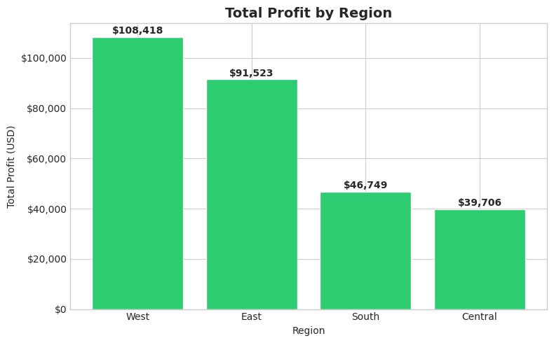

# 🛒 Sales Analytics Pipeline
### End-to-End Medallion Architecture | PySpark · Delta Lake · Databricks

---

## 📌 Project Overview

This project implements a **production-grade data engineering pipeline** on Databricks Community Edition, transforming raw retail sales data into actionable business insights using the **Medallion Architecture** (Bronze → Silver → Gold).

The pipeline processes the Superstore Sales dataset (~10,000 orders) and answers real business questions around regional profitability, loss-making product categories, customer segment behavior, and state-level performance.

> Built as a portfolio project to demonstrate enterprise-level data engineering and business analytics skills.

---

## 🏗️ Architecture

```
┌─────────────────────────────────────────────────────────────┐
│                    RAW DATA SOURCE                          │
│              Superstore Sales CSV (~10K rows)               │
└─────────────────────┬───────────────────────────────────────┘
                      │
                      ▼
┌─────────────────────────────────────────────────────────────┐
│                  🥉 BRONZE LAYER                            │
│         01_bronze_ingestion.py                              │
│  • Raw CSV ingested as-is into Delta table                  │
│  • No transformations — preserves original data             │
│  • Delta table: bronze_sales                                │
└─────────────────────┬───────────────────────────────────────┘
                      │
                      ▼
┌─────────────────────────────────────────────────────────────┐
│                  🥈 SILVER LAYER                            │
│         02_silver_transformation.py                         │
│  • Data type casting (dates, decimals)                      │
│  • Null removal and data quality checks                     │
│  • Derived columns: Profit Margin %, Order Status,          │
│    Shipping Days                                            │
│  • Delta table: silver_sales                                │
└─────────────────────┬───────────────────────────────────────┘
                      │
                      ▼
┌─────────────────────────────────────────────────────────────┐
│                  🥇 GOLD LAYER                              │
│         03_gold_insights.py                                 │
│  • gold_region_performance                                  │
│  • gold_category_loss                                       │
│  • gold_segment_analysis                                    │
│  • gold_top_states                                          │
└─────────────────────┬───────────────────────────────────────┘
                      │
                      ▼
┌─────────────────────────────────────────────────────────────┐
│                  📊 VISUALIZATIONS                          │
│         04_visualizations.py                                │
│  • Regional profit bar chart                                │
│  • Loss-making sub-categories chart                         │
│  • Customer segment comparison                              │
│  • Top/Bottom 10 states chart                               │
└─────────────────────────────────────────────────────────────┘
```

---

## ❓ Business Questions Answered

| # | Question | Gold Table |
|---|----------|------------|
| 1 | Which region generates the highest total profit and margin? | `gold_region_performance` |
| 2 | Which product sub-categories are consistently loss-making? | `gold_category_loss` |
| 3 | How do Consumer, Corporate & Home Office segments compare? | `gold_segment_analysis` |
| 4 | Which states are the top 10 and bottom 10 by profitability? | `gold_top_states` |

---

## 🛠️ Tech Stack

| Layer | Technology |
|-------|-----------|
| Processing Engine | Apache Spark (PySpark) |
| Storage Format | Delta Lake |
| Platform | Databricks Community Edition |
| Language | Python 3 |
| Version Control | Git + GitHub |
| Visualization | Matplotlib |
| Dataset | [Superstore Sales — Kaggle](https://www.kaggle.com/datasets/vivek468/superstore-dataset-final) |

---

## 📁 Folder Structure

```
sales-analytics-pipeline/
│
├── notebooks/
│   ├── 01_bronze_ingestion.py       # Raw data ingestion
│   ├── 02_silver_transformation.py  # Cleaning & feature engineering
│   ├── 03_gold_insights.py          # Business aggregations
│   └── 04_visualizations.py         # Charts & dashboards
│
├── data/
│   └── superstore.csv               # Source dataset (not tracked in git)
│
├── docs/
│   └── architecture.md              # Detailed architecture notes
│
├── assets/
│   └── screenshots/                 # Chart screenshots for README
│
├── .gitignore
└── README.md
```

---

## 🚀 How to Run

### Prerequisites
- Databricks Community Edition account ([Sign up free](https://community.cloud.databricks.com))
- Superstore dataset CSV downloaded from Kaggle

### Step 1 — Upload Dataset
1. Login to Databricks
2. Go to **Data → Add Data → Upload File**
3. Upload `superstore.csv`
4. Note the file path: `/FileStore/tables/superstore.csv`

### Step 2 — Create a Cluster
1. Go to **Compute → Create Cluster**
2. Select the default runtime (any Databricks Runtime with Spark)
3. Click **Create Cluster** and wait for it to start

### Step 3 — Run Notebooks in Order
Create each notebook in Databricks, paste the code from the `notebooks/` folder, and run them **in order**:

```
01_bronze_ingestion      →  Creates: bronze_sales
02_silver_transformation →  Creates: silver_sales
03_gold_insights         →  Creates: gold_region_performance
                                      gold_category_loss
                                      gold_segment_analysis
                                      gold_top_states
04_visualizations        →  Renders: 4 business charts
```

### Step 4 — Verify Tables
In Databricks, go to **Data → default database** to confirm all Delta tables are created.

---

## 📊 Sample Insights

### Regional Performance


### Loss-Making Sub-Categories
.png)

### Customer Segment Analysis
.png)

### Top & Bottom States
.png)

### Key Findings
| Insight | Finding |
|---------|---------|
| Total Orders Processed | 9,994 |
| Loss-Making Orders | 1,871 (18.7%) |
| Avg Profit Margin | 12.03% |
| Most Profitable Region | West ($108,418 profit, 21.95% margin) |
| Least Profitable Region | Central (-10.41% avg margin) |
| Worst Loss Sub-Category | Binders ($38,510 loss across 613 orders) |
| Highest Discount on Loss Orders | Appliances (80% avg discount) |
| Best Customer Segment | Consumer ($134,119 total profit) |
| Highest Margin Segment | Home Office (14.29% avg margin) |
| Top Performing State | California ($76,381 profit) |
| Worst Performing State | Texas (-$25,729 loss) |

---

## 👤 Author

**Aryan Kale**
MCA Student | Savitribai Phule Pune University
[LinkedIn](https://www.linkedin.com/in/aryan-kale-60795a281) · [GitHub](https://github.com/AryanKale-git) · [Portfolio](https://www.self.so/aryan-kale-lhskzm)

---

## 📄 License
This project is open source and available under the [MIT License](LICENSE).
=======
# Sales-Analytics-Pipeline
End-to-end Medallion Architecture pipeline using PySpark and Delta Lake on Databricks

=======